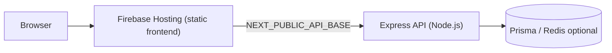

# OmniNumerology

Multi-system numerological intelligence and real-time decision platform.

OmniNumerology unifies several classical numerology systems into a single engine and
presents the results through a wellness-oriented, trilingual interface with energy
remedies, an oracle, a personal AI assistant, and a downloadable PDF report.

## Features

- **Multi-system engine** — Pythagorean, Chaldean, Kabbalah, Vedic (Chaldean-derived),
  Lo Shu grid, name optimization, team synastry, and micro-timing (Personal Hour Clock).
- **Trilingual UI** — English, Hindi (हिन्दी), and Marathi (मराठी) with localized meanings.
- **Wellness content** — energy readings, Reiki, Panchatatva (five elements), and Aura,
  presented in a spiritual/energy tone (not medical advice).
- **Oracle & AI assistant** — a local knowledge-first assistant with optional
  OpenAI-compatible LLM layer and graceful local fallback.
- **PDF report** — image-based (jsPDF + html2canvas) for reliable Devanagari rendering.
- **Cosmic background** — seeded starfield that adapts and cross-fades per segment.
- **Fully responsive** — no horizontal overflow on phone, tablet, or desktop.

## Tech stack

- **Frontend**: Next.js 14 (App Router), React 18, TypeScript, Tailwind CSS,
  Framer Motion, Radix UI, TanStack Query, Zustand
- **Backend**: Express 4, TypeScript, Zod (validation)
- **Optional persistence**: Prisma (PostgreSQL) and ioredis (Redis) — both degrade
  gracefully and are not required for production
- **Testing**: Vitest (113 tests)

## Architecture



The frontend is a static export served by Firebase Hosting (free Spark plan). It calls
the Express API at an absolute URL configured via `NEXT_PUBLIC_API_BASE`, allowing the
two to live on separate hosts. The core calculation engine is pure TypeScript with no
external arithmetic dependencies.

## Getting started

```bash
npm install --include=dev
npm run dev
```

This starts the Next.js frontend on `:3000` and the API on `:4000`. The dev server
proxies `/api/*` to the backend, so no `NEXT_PUBLIC_API_BASE` is needed locally.

## Scripts

| Script              | Description                                          |
| ------------------- | ---------------------------------------------------- |
| `npm run dev`       | Run frontend (`:3000`) + backend (`:4000`) together  |
| `npm run dev:web`   | Run only the Next.js frontend                        |
| `npm run dev:server`| Run only the Express API (watch mode)                |
| `npm run build`     | Build the Next.js app                                |
| `npm run export`    | Build a static export to `out/`                      |
| `npm run build:server` | Compile the backend to CommonJS in `dist/`         |
| `npm run start:prod`   | Run the compiled backend (`node dist/server/index.js`) |
| `npm run start`     | Run the built Next.js app                            |
| `npm run start:server` | Run the Express API (tsx)                          |
| `npm test`          | Run the test suite (Vitest)                          |
| `npm run lint`      | Type-check the project (`tsc --noEmit`)              |

## API endpoints

| Method | Path                    | Description                            |
| ------ | ----------------------- | -------------------------------------- |
| GET    | `/api/health`           | Health check                           |
| POST   | `/api/matrix/calculate` | Unified numerology matrix              |
| POST   | `/api/timing/*`         | Micro-timing / Personal Hour Clock     |
| POST   | `/api/optimize/name`    | Name optimization suggestions          |
| POST   | `/api/synastry/team`    | Team / synastry compatibility          |
| POST   | `/api/oracle/chat`      | Oracle chat (streaming)                |
| POST   | `/api/assistant/chat`   | AI assistant chat (streaming)          |

## Environment variables

Copy `.env.example` to `.env` and adjust as needed:

| Variable               | Purpose                                             |
| ---------------------- | --------------------------------------------------- |
| `PORT`                 | Backend port (default `4000`)                       |
| `NEXT_PUBLIC_API_BASE` | Absolute backend URL for the browser (split hosting)|
| `API_PROXY_TARGET`     | Dev proxy target (`http://localhost:4000`)          |
| `DATABASE_URL`         | Optional PostgreSQL URL (Prisma)                    |
| `REDIS_URL`            | Optional Redis URL (caching)                        |
| `USER_LLM_API_KEY`     | Optional LLM key for the assistant                  |
| `USER_LLM_BASE_URL`    | Optional OpenAI-compatible base URL                 |
| `USER_LLM_MODEL`       | Optional LLM model name                             |

## Deployment

See `FIREBASE_DEPLOY.md` for the full split-hosting guide. In short:

1. Deploy the backend (`npm run build:server && npm run start:prod`) to any free Node.js
   host (Render, Railway, Fly.io, or a VPS) — a `Dockerfile` is included.
2. Build the frontend against that URL: `NEXT_PUBLIC_API_BASE=<backend-url> npm run export`.
3. Deploy the static `out/` to Firebase Hosting (free): `firebase deploy --only hosting`.

## Disclaimer

OmniNumerology is provided for entertainment, reflection, and personal growth. Its
wellness and energy content is spiritual in nature and is **not** medical, financial,
legal, or professional advice.
